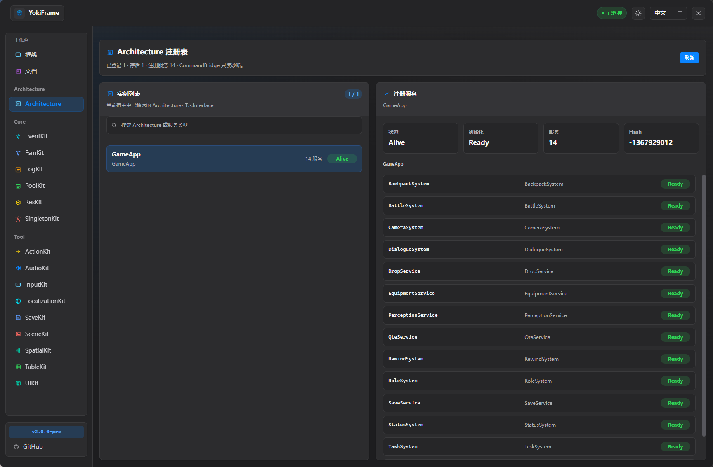
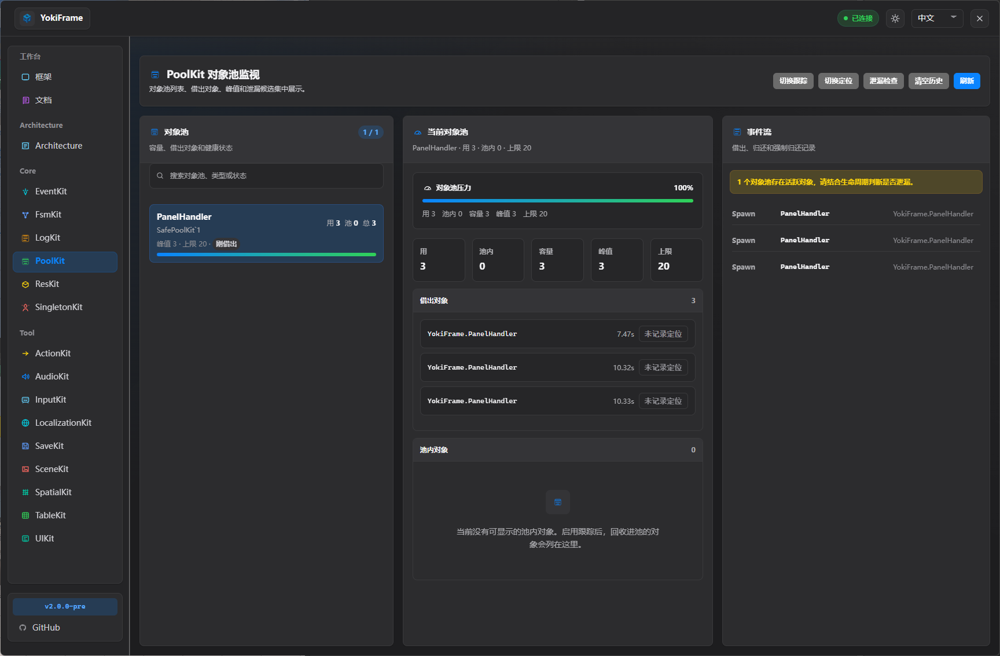
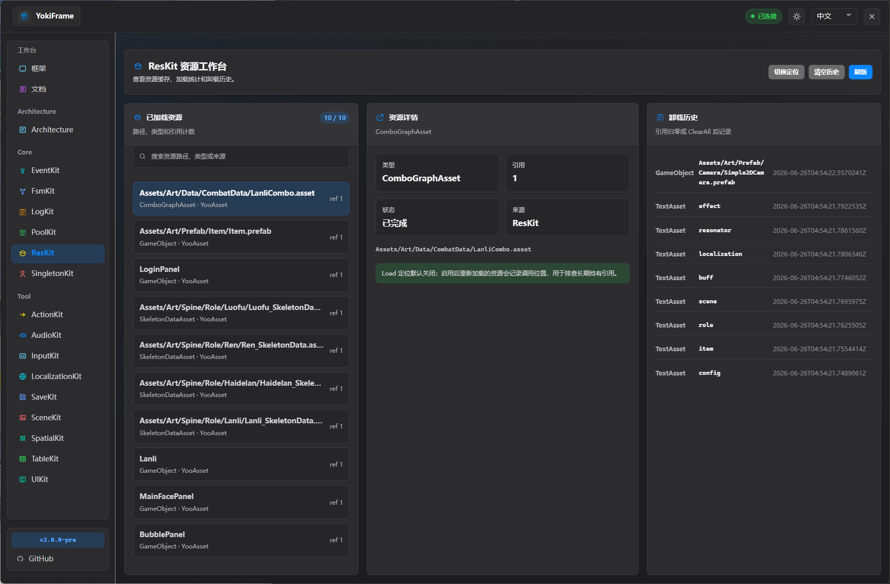
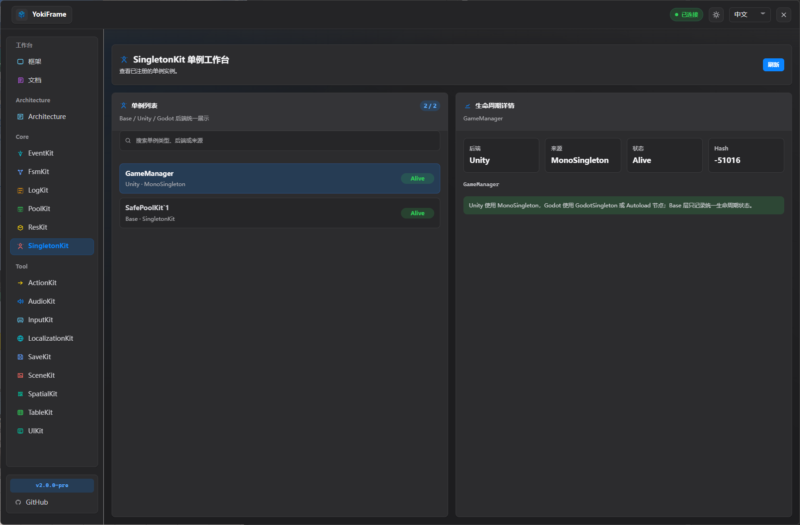

# YokiFrame

<p align="center">
  
</p>

<p align="center">
  <b>Cross-engine game Kit framework + AI-native communication layer + Tauri visual workbench</b><br>
  Runtime capabilities are exposed through a unified C# Kit API, while a file protocol lets AI agents, tool frontends, and engine hosts collaborate reliably.
</p>

---

## What Is YokiFrame?

YokiFrame is no longer just a Unity-bound toolkit. It is a multi-host game development framework. Events, state machines, pools, resources, singletons, logging, actions, audio, input, scenes, saves, UI, tables, localization, and other runtime capabilities are organized behind stable Kit APIs. Unity, Godot, and future hosts provide adapters.

The current framework focuses on three things:

| Direction | What YokiFrame Provides |
| --- | --- |
| Cross-engine design | The Runtime core stays pure C# by default. Host-specific behavior enters through Unity / Godot adapters, while gameplay code keeps using the unified `YokiFrame` entry points. |
| AI-native communication | The `.yokiframe/` file bridge is a framework-level control plane. AI agents can discover engines, send commands, read responses, and inspect snapshots without depending on Unity MCP. |
| Visual editor tooling | A Tauri + Web desktop workbench brings Kit state, command bridge health, code scanning, generators, and runtime diagnostics into one modern developer console. |

---

## Core Capabilities

### Unified Kit API

Gameplay code should prefer the unified entry points under the `YokiFrame` namespace:

| Kit | Capability |
| --- | --- |
| Architecture | Service registration, modular organization, and runtime architecture diagnostics. |
| EventKit | Typed events, enum events, and legacy string-event compatibility for decoupled modules. |
| FsmKit | Basic FSMs, parameterized FSMs, hierarchical state machines, and runtime state diagnostics. |
| PoolKit | C# object pools, recyclable object pools, collection pools, and workbench snapshots. |
| ResKit | Unified resource loading, raw file loading, scene resource backends, reference counting, and provider replacement. |
| SingletonKit | A unified lifecycle view for pure C# singletons, Unity `MonoSingleton`, and Godot `GodotSingleton`. |
| LogKit | Engine log adaptation, runtime log files, and workbench log diagnostics. |
| ActionKit | Delay, callback, parallel, repeat, Task / Coroutine composition, and action tree debugging. |
| AudioKit | SFX, music, volume buses, active voice diagnostics, and audio ID generation helpers. |
| SaveKit | Multi-slot saves, serialization / encryption / migration backends, and auto-save state. |
| InputKit | Input backends, action state, input buffers, and context stacks. |
| SceneKit | Cross-engine scene loading, preloading, activation, and unload backends. |
| SpatialKit | HashGrid, Quadtree, Octree spatial indexes, and query diagnostics. |
| LocalizationKit | Language providers, formatters, caches, binders, and language switching. |
| UIKit | UI backend, panel stack, layers, panel creation, and binding helpers. |
| TableKit | Tauri-based Luban table generation, parameter management, and output validation. |

### Cross-Engine Adapters

The layering rule is simple: the core API does not need to know whether it is running in Unity or Godot.

```text
User Code
  -> YokiFrame Kit API
  -> Core Runtime interfaces / providers / handlers
  -> Unity or Godot Adapter
  -> Engine runtime and editor
```

The package layout is:

```text
YokiFrame/
├── Core/
│   ├── Runtime/
│   │   ├── Architecture, EventKit, FsmKit, PoolKit, ResKit, Singleton, LogKit
│   │   ├── Interfaces, ToolClass, FluentApi, Settings
│   │   ├── CommandBridge
│   │   └── Adapters/
│   │       ├── Unity/
│   │       └── Godot/
│   └── Editor/
│       ├── Skills/
│       └── Resources/
├── Tools/
│   ├── ActionKit, AudioKit, InputKit, LocalizationKit
│   ├── SaveKit, SceneKit, SpatialKit, TableKit, UIKit
│   └── ...
└── Installer~/
```

Core abstractions include `IEngineLogger`, `IEngineTime`, `IEngineObject`, `IResourceProvider`, `IRawResourceProvider`, `IResSceneBackend`, and `ISerializationProvider`. Tool Kits isolate host behavior through backend interfaces such as `IAudioBackend`, `IInputBackend`, `ISceneBackend`, and `IUIBackend`. SceneKit delegates to the active ResKit scene backend by default, and UIKit's default panel loader loads panels through ResKit. When switching between Unity Resources, YooAsset, or a custom project resource system, replacing the ResKit provider is usually the first move.

The Unity adapter provides `UnityBootstrap`, `UnityResourceProvider`, `MonoSingleton<T>`, Unity math conversion extensions, the Unity CommandBridge host, the Tauri launcher, event / snapshot / telemetry publishers, Editor UI Toolkit components and style services, plus optional integrations for YooAsset, DOTween, FMOD, Unity Input, and Unity UI.

The Godot adapter provides `GodotBootstrap`, `GodotAutoBootstrap`, `GodotResourceProvider`, `GodotSingleton<T>`, the Godot CommandBridge host, event and FSM bridges, Kit snapshot publishers, and installer entry points for input, scenes, UI, and saves. The Godot integration targets Godot 4.7 `.NET / C#` projects.

---

## AI-Native Communication

YokiFrame treats AI access as a framework capability, not as an attachment to a single editor plugin. The core mechanism is the `.yokiframe/` file bridge:

```text
.yokiframe/
└── engines/
    └── <engineId>/
        ├── engine.json
        ├── status/heartbeat.json
        ├── commands/<requestId>.json
        ├── results/<requestId>-response.json
        ├── snapshots/<kit>/<name>.json
        └── events/*.jsonl
```

### Command Plane

AI agents, Tauri, and scripts can write engine-scoped command files:

```json
{
  "protocolVersion": 2,
  "requestId": "codex-ping-001",
  "engineId": "unity-editor",
  "source": "codex",
  "kit": "System",
  "action": "ping",
  "payload": {},
  "createdAtUtc": "2026-06-24T00:00:00Z",
  "timeoutMs": 10000
}
```

The response is written to:

```text
.yokiframe/engines/<engineId>/results/<requestId>-response.json
```

The protocol guarantee is that every accepted command must produce a terminal response. Unknown Kits, unknown actions, parse failures, timeouts, and policy rejections should become standard JSON responses instead of making callers wait silently.

### Snapshots, Events, And Realtime Telemetry

The file bridge is not a high-frequency runtime bus. YokiFrame splits communication into several planes:

| Plane | Purpose |
| --- | --- |
| Command Plane | Request-response commands, such as `System/ping` and `FsmKit/get_workbench_snapshot`. |
| Snapshot Plane | Overwrite-style current state snapshots, such as `FsmKit/state`, `PoolKit/state`, and `ResKit/state`. |
| Event Plane | Important discrete JSONL events, such as Kit state changes and lifecycle notices. |
| Realtime Telemetry Plane | Latest-frame shared memory used for human-perceived realtime updates in Tauri pages. |
| Trace Plane | Explicitly enabled short-term diagnostic ring buffers. |

AI agents read snapshots or use command/result by default. The Tauri workbench reads telemetry first, falls back to snapshots, and only uses command/result for user actions, detail queries, or missing data. This keeps AI access reliable without turning hot runtime paths into cross-process file polling.

### AI Skills

The package includes Skill documents for AI agents:

```text
YokiFrame/Core/Editor/Skills/
├── yokiframe/
├── yokiframe-editor/
└── yokiframe-command-bridge/
```

The Tauri workbench also provides an AI Skill installation entry so project-local YokiFrame guidance can be synchronized to Codex and other agent skill directories. AI tools do not need to guess Unity internals directly; they can discover the engine registry first, then query Kit state through the protocol.

---

## Tauri Visual Workbench

YokiFrame Editor is a Tauri + Web desktop workbench. It is not a marketing page. It is a developer console for the debugging loop: connect to hosts, inspect Kit state, observe runtime changes, run read-only diagnostic commands, open code locations, manage generators, and read built-in documentation.

In Unity / Godot editors, the workbench is typically opened with `Ctrl+E`.

### Workbench Preview

#### Console

<p align="center">
  
</p>

Check whether Unity / Godot hosts are connected, inspect heartbeat, command queues, FileBridge state, and runtime logs, and install or sync YokiFrame Skills for agents such as Codex, Claude Code, Cursor, Windsurf, and GitHub Copilot.

#### Architecture

<p align="center">
  
</p>

Inspect the current architecture instance, registered service count, initialization state, and service implementation list to confirm whether game entry points, system services, and dependency registration are ready.

#### FsmKit

<p align="center">
  
</p>

View active state machines, current states, state flow graphs, and transition history. This is useful for diagnosing transitions, loop risks, and runtime flow.

#### PoolKit

<p align="center">
  
</p>

Monitor pool capacity, rented objects, peaks, and leak risk. When needed, enable tracking, locate rented objects, or clear diagnostic history.

#### ResKit

<p align="center">
  
</p>

Inspect loaded resources, reference counts, resource types, load sources, and unload history to locate unreleased resources, duplicate loads, or provider integration issues.

#### UIKit

<p align="center">
  
</p>

Inspect current panels, panel stack, layers, UIRoot settings, and cache state. This helps diagnose panels that failed to open, wrong layers, abnormal stack state, and Canvas configuration issues.

#### SingletonKit

<p align="center">
  
</p>

View Core / Unity / Godot singleton instances and lifecycle state to confirm whether `MonoSingleton`, `GodotSingleton`, or pure C# singletons are registered and alive.

Current workbench pages include:

| Page | Capability |
| --- | --- |
| System | Engine connection, heartbeat, engine registry, FileBridge health, command catalog, and logs. |
| Architecture | Current architecture instance, registered services, and service implementation diagnostics. |
| EventKit | Event registration relationships, recent events, code scanning, and send / listen / unregister graphs. |
| FsmKit | State machine list, state flow graph, current state, transition history, and lifecycle events. |
| PoolKit | Pool statistics, pool details, peaks, cached count, and current snapshot. |
| ResKit | Resource cache, reference count, provider state, and resource loading diagnostics. |
| LogKit | Runtime logs, log configuration, file output, and error location. |
| ActionKit | Action trees, execution state, stack trace switch, and current action statistics. |
| AudioKit | Active sounds, volume buses, playback history, and audio ID / path generator. |
| SaveKit | Save slots, auto-save, storage / serialization / encryption backend state. |
| LocalizationKit | Language list, provider, formatter, cache, and language switching commands. |
| SceneKit | Scene loading state, preload / unload diagnostics, and scene backend. |
| SpatialKit | Spatial index list, entity statistics, and query structure diagnostics. |
| InputKit | Current device, action state, input buffer, and context stack. |
| UIKit | Panel list, panel stack, layers, Unity panel Prefab creation, and binding helpers. |
| TableKit | Luban environment detection, generation parameters, output directories, execution logs, and validation. |
| SingletonKit | Core / Unity / Godot singleton instances and lifecycle state. |
| Docs | Quick start, Kit docs, API reference, and third-party dependency notes. |

The frontend development source in this repository is under `YokiFrameTools/TauriEditor/dist`. The packaged cross-engine runtime copy is:

```text
YokiFrame/TauriRuntime~/dist
```

---

## Installation And Integration

<p align="center">
  
</p>

### Installer

The recommended path is the lightweight installer shipped with the package. It installs YokiFrame into Unity or Godot projects:

```text
YokiFrame/Installer~/win-x64/YokiFramePackageTool.exe
```

The installer detects the target project type and creates an installation plan for the selected engine:

| Target Project | Mode | Notes |
| --- | --- | --- |
| Unity | Local package | Copies into `Packages/com.hinatayoki.yokiframe`, useful for offline use or local source editing. |
| Unity | Git package | Writes to `Packages/manifest.json`, allowing future updates through Unity Package Manager. |
| Godot | Local package | Installs into `addons/yokiframe/package/YokiFrame` in a Godot 4.7 `.NET / C#` project and creates the Godot plugin entry. |

Unity local package mode and Godot mode require selecting the YokiFrame source directory. Unity Git package mode only needs the target Unity project directory and the Git URL.

### Unity Git URL

Unity projects can also install YokiFrame directly through Unity Package Manager:

1. Open `Window > Package Manager`.
2. Click `+` > `Add package from git URL`.
3. Enter the Git URL:

```text
https://github.com/HinataYoki/YokiFrame.git
```

On the current GitHub `main` branch, the Unity package root is the repository root, so the default URL does not need `?path=`. To pin a branch, tag, or commit, append `#branch-or-tag` to the URL. Only append `?path=/subdir` when the target branch or tag actually places `package.json` in a subdirectory.

### Unity Initialization

The minimal runtime initialization is one line:

```csharp
using YokiFrame;

YokiFrameKit.Initialize(YokiFrameEngine.Unity);
```

`YokiFrameKit` tells the available Kit installers to install default backends for the Unity host, such as ResKit's `UnityResourceProvider`, LogKit's Unity logger, and optional Tool Kit Unity backends. Initialization is not mandatory when only using EventKit, FsmKit, PoolKit, or pure C# singletons. It is recommended during project startup when using host-backed capabilities such as ResKit, AudioKit, InputKit, SceneKit, and UIKit.

When switching to YooAsset or a custom resource system, prefer replacing only the ResKit provider:

```csharp
ResKit.SetProvider(new YooAssetResourceProvider());
```

The built-in `UnityResourceProvider` and `YooAssetResourceProvider` both provide normal resources, raw files, and scene loading. SceneKit follows the active ResKit provider by default. UIKit's default `DefaultPanelLoader` also loads panels through `ResKit.LoadAsset<GameObject>()`, so there is no separate YooAsset initialization entry or dedicated PanelLoader. The default panel path remains `Art/UIPrefab/<PanelName>`. If YooAsset uses the panel type name as the addressable location, configure it at startup:

```csharp
ResKit.SetProvider(new YooAssetResourceProvider());
UIKit.GetPanelLoader().UseAddressableLocation = true;

// If the current UIKit loader pool has not been created yet, set the global default for new pools.
DefaultPanelLoaderPool.DefaultUseAddressableLocation = true;
```

If you still want scene lifecycle auto-driving, keep a lightweight `MonoBehaviour` shell:

```csharp
using UnityEngine;
using YokiFrame.Unity;

public sealed class GameStartup : MonoBehaviour
{
    private void Awake()
    {
        _ = UnityBootstrap.Instance;
    }
}
```

`UnityBootstrap` also calls the unified entry point internally, and forwards `YokiFrameKit.Tick` and `YokiFrameKit.Shutdown` from `Update` / `OnDestroy`. It is an optional lifecycle shell, not the only initialization body.

### Common Unity Adapter Helpers

The public Unity adapter entry point is `YokiFrame.Unity`. Cross-engine Runtime code continues to use `YokiVector2`, `YokiVector3`, `YokiRect`, and `YokiBounds`. Unity gameplay code can convert both ways between `Vector2`, `Vector3`, `Rect`, and `Bounds` through extension methods instead of manually mapping fields at call sites.

```csharp
using UnityEngine;
using YokiFrame;
using YokiFrame.Unity;

var bounds = new Bounds(Vector3.zero, Vector3.one * 1000f).ToYokiBounds();
var octree = SpatialKit.CreateOctree<MySpatialEntity>(bounds);

var position = transform.position.ToYokiVector3();
mIndex.QueryRadius(position, sensor.Range, mQueryBuffer);
```

Unity Editor UI Toolkit templates, design tokens, icons, and style services also live under `YokiFrame.Unity`. Import this namespace when using `YokiStyleService`, `YokiStyleProfile`, or `KitIcons` in custom Inspectors or EditorWindows. Add a static import for `YokiFrameUIComponents` when writing `Spacing.SM`, `Colors.TextPrimary`, `Radius.LG`, or `CreateModernToggle()` directly.

When upgrading from 1.0, start with the migration notes in `TauriRuntime~/dist/docs/quick-start.md`. It maps the practical replacements for `UIPanel.Data`, SceneKit events, YooInit, AudioKit, SaveKit, and Unity UI Toolkit entries.

```csharp
#if UNITY_EDITOR
using UnityEditor;
using UnityEngine.UIElements;
using YokiFrame.Unity;
using static YokiFrame.Unity.YokiFrameUIComponents;

public sealed class MyInspector : Editor
{
    public override VisualElement CreateInspectorGUI()
    {
        var root = new VisualElement();
        YokiStyleService.Apply(root, YokiStyleProfile.CoreOnly);
        root.style.marginTop = Spacing.SM;

        root.Add(CreateModernToggle("Enable", true, value => { }));
        return root;
    }
}
#endif
```

### Godot

The installer installs the package into a Godot 4.7 `.NET / C#` project and creates the root plugin entry:

```text
addons/yokiframe/plugin.cfg
addons/yokiframe/plugin.gd
addons/yokiframe/package/YokiFrame/
```

After the Godot plugin is enabled, it registers bootstrap, autoload, the `.yokiframe` working directory, and the Godot engine registry. Runtime commands enter through `.yokiframe/engines/godot-runtime/commands/*.json`, and responses are read from that engine's `results` directory.

### Optional Third-Party Integrations

| Dependency | Purpose |
| --- | --- |
| UniTask | When `YOKIFRAME_UNITASK_SUPPORT` is enabled in Unity projects, async APIs in ResKit / SaveKit and related Kits can switch to `UniTask<T>`. |
| YooAsset | Optional Unity ResKit resource backend. |
| DOTween | Optional ActionKit / UIKit animation integration. |
| FMOD | Optional AudioKit backend. |
| Luban | TableKit table generation workflow. |

---

## Common Code

### EventKit

```csharp
using YokiFrame;

public readonly struct PlayerDiedEvent
{
    public readonly string PlayerName;

    public PlayerDiedEvent(string playerName)
    {
        PlayerName = playerName;
    }
}

EventKit.Type.Register<PlayerDiedEvent>(OnPlayerDied);
EventKit.Type.Send(new PlayerDiedEvent("Player"));
EventKit.Type.UnRegister<PlayerDiedEvent>(OnPlayerDied);
```

### FsmKit

```csharp
using YokiFrame;

var fsm = new FSM<PlayerState>("PlayerFSM");
fsm.Add(PlayerState.Idle, new IdleState(fsm, owner));
fsm.Add(PlayerState.Run, new RunState(fsm, owner));
fsm.Start(PlayerState.Idle);

fsm.Change(PlayerState.Run);
fsm.Update();
```

### ResKit

```csharp
using YokiFrame;

var handle = ResKit.LoadAsset<MyConfig>("Configs/GameConfig");
try
{
    Use(handle.Asset);
}
finally
{
    handle.Release();
}
```

### ActionKit

```csharp
using YokiFrame;

IActionController controller = ActionKit.Sequence()
    .Callback(OnStarted)
    .Delay(0.5f)
    .Callback(OnFinished)
    .Start();

controller.Pause();
controller.Resume();
controller.Cancel();
```

---

## Technical Constraints

- The Unity package declares compatibility with Unity 2022.3+. The current repository development environment covers Unity 6000.x.
- Godot integration targets Godot 4.7 `.NET / C#` projects.
- C# code remains compatible with C# 9.0 and does not use C# 10+ syntax.
- Core Runtime does not directly depend on Tauri. Cross-process communication is implemented through the `.yokiframe` protocol and adapter layers.
- File bridge protocol fields use safe ASCII identifiers. Commands should be written through a temporary file followed by an atomic rename.
- High-frequency runtime state is not written to files on every update. Adapter caching, throttling, snapshots, and telemetry are responsible for visual refresh.

---

## Documentation Entry Points

| Goal | Location |
| --- | --- |
| Quick start and Kit docs | `Docs` page in the Tauri workbench |
| Tauri built-in documentation source | `TauriRuntime~/dist/docs` |
| AI command bridge Skill | `Core/Editor/Skills/yokiframe-command-bridge/SKILL.md` |
| YokiFrame usage Skill | `Core/Editor/Skills/yokiframe/SKILL.md` |

---

## License

MIT License
