# YokiFrame

<p align="center">
  <a href="README.md">中文</a> | <a href="README.en.md">English</a>
</p>

<p align="center">
  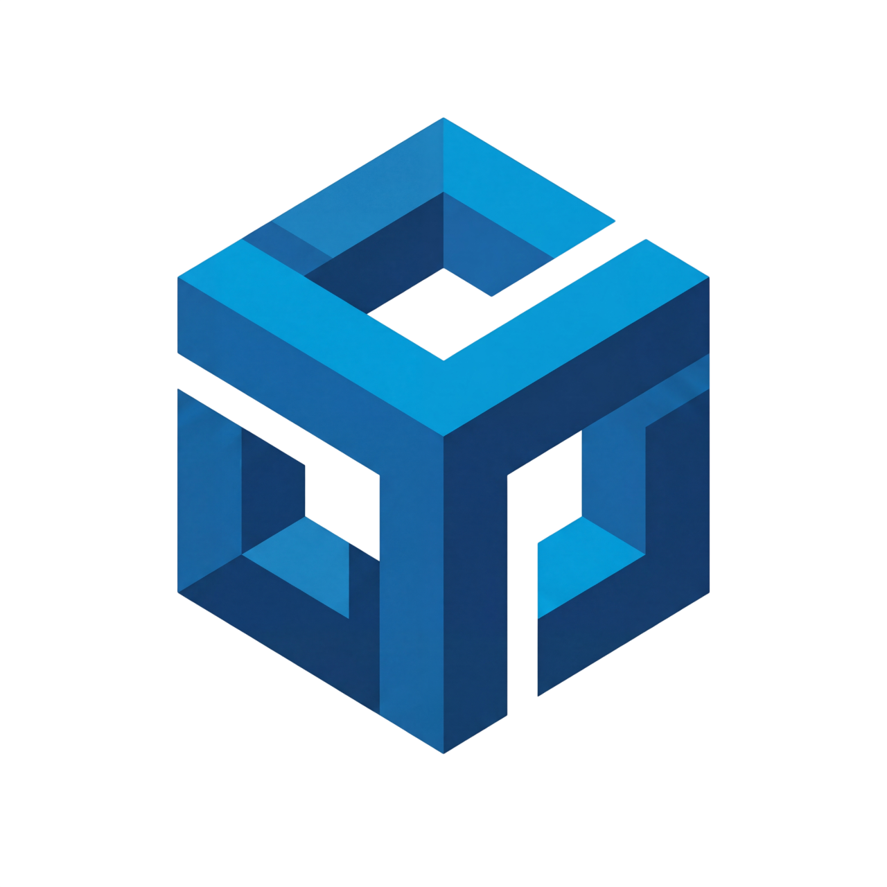
</p>

<p align="center">
  <b>A C# game Kit framework that is not tied to one engine</b><br>
  YokiFrame connects game runtime code, toolchains, and AI agents through unified Runtime APIs, cross-engine adapters, an AI-friendly file protocol, and a Tauri editor workbench.
</p>

---

## One-Line Introduction

YokiFrame 2.0 is a cross-engine game development framework. Gameplay code is written against the unified Kit APIs in the `YokiFrame` namespace, while Unity, Godot, or future hosts provide engine-specific capabilities through adapters: logging, time, resources, input, scenes, UI, audio, and more.

It also ships with the `.yokiframe/` file protocol, allowing AI agents, the Tauri workbench, scripts, and game hosts to exchange commands, responses, snapshots, events, and realtime telemetry reliably. AI tools do not need to guess Unity objects or depend on a single editor plugin; they can discover online engines, inspect framework state, run read-only diagnostics, or execute explicitly authorized maintenance commands.

YokiFrame also provides a complete Tauri visual editor tool for Kit state, command bridge health, runtime snapshots, code scanning, generators, logs, and built-in documentation.

---

## Core Positioning

| Question | YokiFrame's Answer |
| --- | --- |
| Does gameplay logic have to be tied to Unity or Godot? | No. The business layer uses unified Kit APIs, while host differences live in adapters, providers, and backends. |
| How can AI understand runtime state? | Through `.yokiframe/engines/<engineId>`: discover hosts, read snapshots / telemetry, and send commands when needed. |
| Is the editor tool only a launcher? | No. The Tauri workbench is a dedicated debugging console for Kit state, FileBridge health, code scanning, generators, and docs. |
| Does the framework force one resource or UI solution? | No. ResKit, SceneKit, UIKit, AudioKit, and related Kits are replaceable through providers / backends. |

---

## Overall Architecture

The main idea is simple: gameplay code knows framework capabilities, not engine internals.

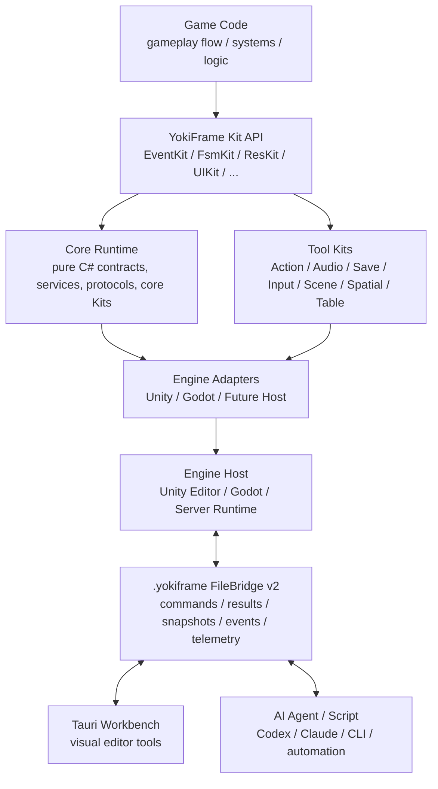

### Runtime Layers

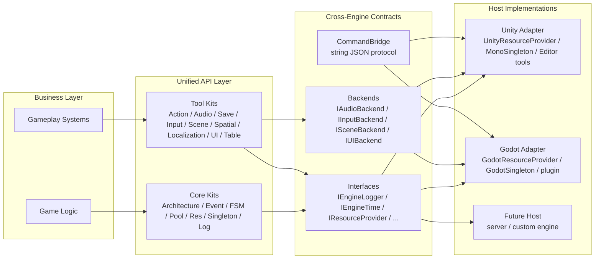

### Directory Layout

```text
Assets/YokiFrame/
├── Core/
│   ├── Runtime/
│   │   ├── Architecture, EventKit, FsmKit, PoolKit, ResKit
│   │   ├── Singleton, LogKit, ToolClass, FluentApi, Settings
│   │   ├── Interfaces/
│   │   ├── CommandBridge/
│   │   └── Adapters/
│   │       ├── Unity/
│   │       └── Godot/
│   ├── Editor/
│   │   ├── CodeGenKit/
│   │   ├── Resources/
│   │   └── Skills/
│   └── Tests/
├── Tools/
│   ├── ActionKit, AudioKit, InputKit, LocalizationKit
│   ├── SaveKit, SceneKit, SpatialKit, TableKit, UIKit
│   └── */Runtime, */Editor, */Tests
├── TauriRuntime~/        # packaged workbench runtime copy
├── Installer~/           # packaged installer
└── Documentation~/       # images and supporting README material

YokiFrameTools/
├── TauriEditor/          # Tauri workbench source
├── Installer/            # installer source
└── scripts/

.yokiframe/               # runtime file protocol directory
```

---

## Kit Capability Map

YokiFrame organizes common game framework capabilities into Kits. Gameplay code calls unified entry points, and host details are installed by adapters and Kit installers.

```mermaid
flowchart TB
    Root["YokiFrame Kits"]
    Core["Core Runtime Kits"]
    Tools["Tool Kits"]
    AI["AI Native Runtime"]
    Editor["Editor Tooling"]

    Root --> Core
    Root --> Tools
    Root --> AI
    Root --> Editor

    Core --> Architecture["Architecture"]
    Core --> EventKit["EventKit"]
    Core --> FsmKit["FsmKit"]
    Core --> PoolKit["PoolKit"]
    Core --> ResKit["ResKit"]
    Core --> SingletonKit["SingletonKit"]
    Core --> LogKit["LogKit"]

    Tools --> ActionKit["ActionKit"]
    Tools --> AudioKit["AudioKit"]
    Tools --> SaveKit["SaveKit"]
    Tools --> InputKit["InputKit"]
    Tools --> SceneKit["SceneKit"]
    Tools --> SpatialKit["SpatialKit"]
    Tools --> LocalizationKit["LocalizationKit"]
    Tools --> UIKit["UIKit"]
    Tools --> TableKit["TableKit"]

    AI --> CommandBridge["CommandBridge"]
    AI --> Snapshot["Snapshot"]
    AI --> Telemetry["Telemetry"]
    AI --> EventStream["Event Stream"]
    AI --> Skills["Agent Skills"]

    Editor --> Workbench["Tauri Workbench"]
    Editor --> CodeScan["Code Scan"]
    Editor --> Generators["Generators"]
    Editor --> Diagnostics["Diagnostics"]
```

| Kit | Main Use |
| --- | --- |
| Architecture | Service registration, module organization, architecture instances, and runtime diagnostics. |
| EventKit | Typed events, enum events, and compatible event channels for decoupled modules. |
| FsmKit | Basic FSMs, parameterized FSMs, state flows, and transition history diagnostics. |
| PoolKit | Object pools, recyclable object pools, collection pools, and pool state snapshots. |
| ResKit | Resource loading, raw files, scene resource backends, reference counting, and provider replacement. |
| SingletonKit | Pure C# singletons, Unity `MonoSingleton<T>`, and Godot `GodotSingleton<T>`. |
| LogKit | Engine log adaptation, file logs, and workbench log diagnostics. |
| ActionKit | Delay, Callback, Sequence, Parallel, Task / Coroutine composition, and action debugging. |
| AudioKit | SFX, music, volume buses, active voice diagnostics, and audio ID helpers. |
| SaveKit | Multi-slot saves, serialization / encryption / migration backends, and auto-save state. |
| InputKit | Input backends, action state, input buffers, and input context stacks. |
| SceneKit | Cross-engine scene loading, preloading, activation, and unloading. |
| SpatialKit | HashGrid, Quadtree, Octree spatial indexes, and query diagnostics. |
| LocalizationKit | Language providers, formatters, caches, binders, and language switching. |
| UIKit | UI backends, panel stack, layers, panel creation, and binding helpers. |
| TableKit | Tauri-based Luban table generation, parameter management, and output validation. |

---

## Lifecycle

The host only needs to declare the current engine at startup. `YokiFrameKit` discovers and installs Kit installers available for that engine, the host drives Tick every frame, and Shutdown closes everything in reverse order.

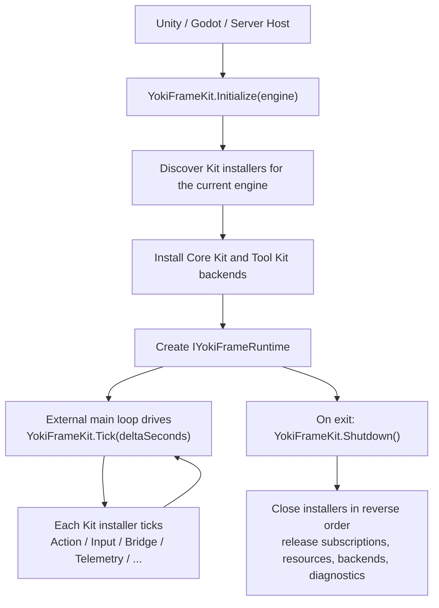

Unity can call the unified entry directly:

```csharp
using YokiFrame;

YokiFrameKit.Initialize(YokiFrameEngine.Unity);
```

You can also use `UnityBootstrap` in a scene. It initializes YokiFrame, forwards Tick from `Update`, and calls Shutdown from `OnDestroy`.

After the Godot plugin is enabled, it creates bootstrap / autoload entries. At runtime, `GodotBootstrap` handles the same lifecycle through `_Ready`, `_Process`, and `_ExitTree`.

---

## AI File Protocol

YokiFrame treats AI communication as a framework-level capability, not as a private channel owned by one IDE plugin. The current protocol entry is the engine-scoped directory:

```text
.yokiframe/
└── engines/
    └── <engineId>/
        ├── engine.json
        ├── status/heartbeat.json
        ├── commands/<requestId>.json
        ├── commands/processing/<requestId>.json
        ├── commands/archive/
        ├── commands/deadletter/
        ├── results/<requestId>-response.json
        └── snapshots/<Kit>/<name>.json

.yokiframe/
└── events/<type>.jsonl
```

### Communication Planes

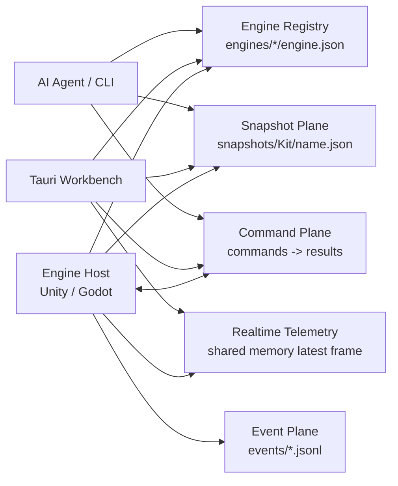

| Plane | Use Case | Read / Write Pattern |
| --- | --- | --- |
| Engine Registry | Discover online Unity / Godot / runtime hosts. | Read `engine.json` first, then choose the target engineId. |
| Command Plane | Request-response commands, detail queries, explicit operations, and maintenance commands. | Write `commands/<requestId>.json`, read `results/<requestId>-response.json`. |
| Snapshot Plane | Current state, panel initial data, and default read-only AI queries. | Overwrite-style JSON snapshots, stable for polling. |
| Event Plane | Important discrete events, lifecycle events, and sampled state changes. | Root-level JSONL event streams. |
| Realtime Telemetry | Human-perceived realtime refresh for Tauri pages. | Latest-frame shared memory, not the default AI query path. |
| Trace Plane | Explicitly enabled short-term high-frequency diagnostics. | Ring buffer constrained by duration, count, and size. |

### Command Flow

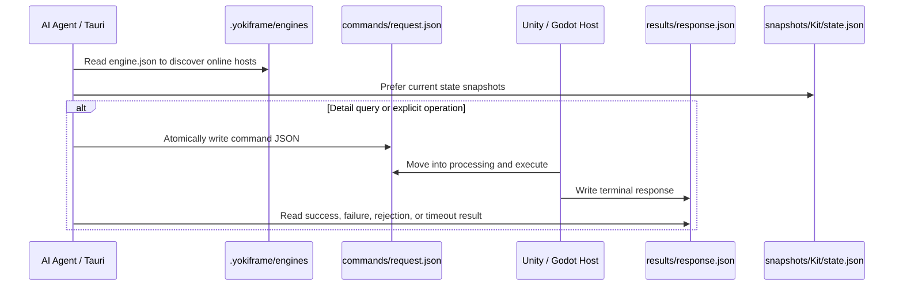

A command request looks roughly like this:

```json
{
  "protocolVersion": 2,
  "requestId": "codex-ping-001",
  "engineId": "unity-editor",
  "source": "codex",
  "kit": "System",
  "action": "ping",
  "payload": {},
  "createdAtUtc": "2026-06-24T00:00:00Z",
  "timeoutMs": 10000
}
```

Protocol rules:

1. New commands, responses, and state reads use `.yokiframe/engines/<engineId>`. Historical root directories are not the current entry point.
2. `requestId`, `engineId`, `source`, `kit`, and `action` use safe ASCII identifiers.
3. Commands and responses are written with temporary files followed by atomic rename / replace, so polling readers never see half-written files.
4. Every accepted command must produce a terminal response. Unknown Kit/action, parse failures, policy rejections, timeouts, and exceptions should leave a result or deadletter evidence.
5. Do not use `send_command` for high-frequency polling. Tauri prefers telemetry; AI prefers snapshots.

---

## Tauri Editor Workbench

YokiFrame Editor is a Tauri + Web desktop workbench. It is built for the development and debugging loop, not as a marketing page.

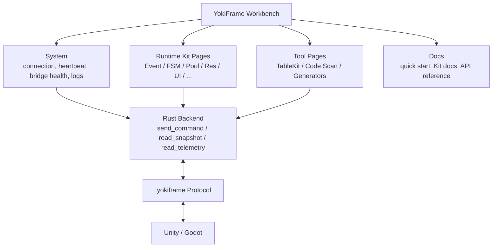

In Unity / Godot editors, the workbench is usually opened with `Ctrl+E`. It can be used to:

- Inspect engine connection, heartbeat, engine registry, FileBridge health, and command catalog.
- Inspect Architecture, EventKit, FsmKit, PoolKit, ResKit, LogKit, ActionKit, AudioKit, SaveKit, LocalizationKit, SceneKit, SpatialKit, InputKit, UIKit, TableKit, and SingletonKit state.
- Scan code relationships, such as EventKit send / listen / unregister locations.
- Open source code locations through the host's default code editor.
- Inspect runtime logs, errors, snapshots, telemetry freshness, and stale states.
- Manage TableKit / Luban generation parameters and output validation.
- Install or sync YokiFrame Skills for agents such as Codex, Claude Code, Cursor, Windsurf, and GitHub Copilot.

### Workbench Preview

<p align="center">
  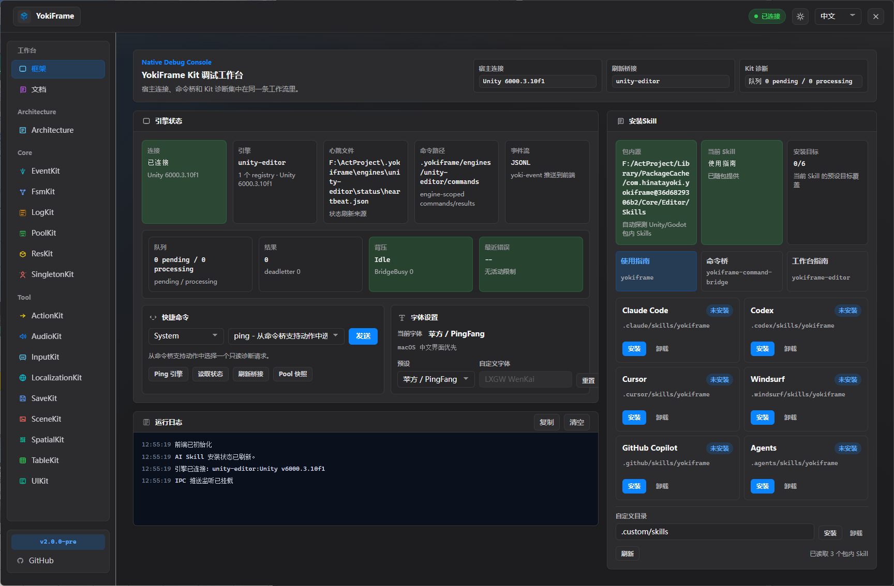
</p>

<p align="center">
  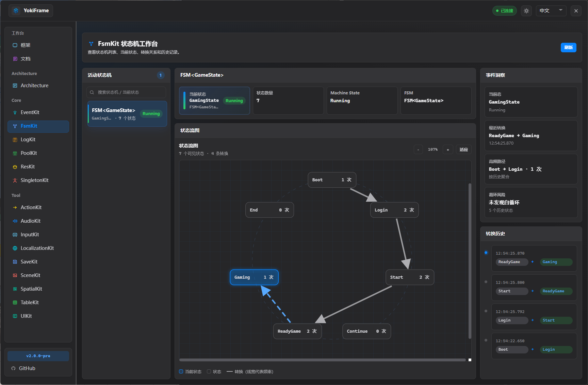
</p>

<p align="center">
  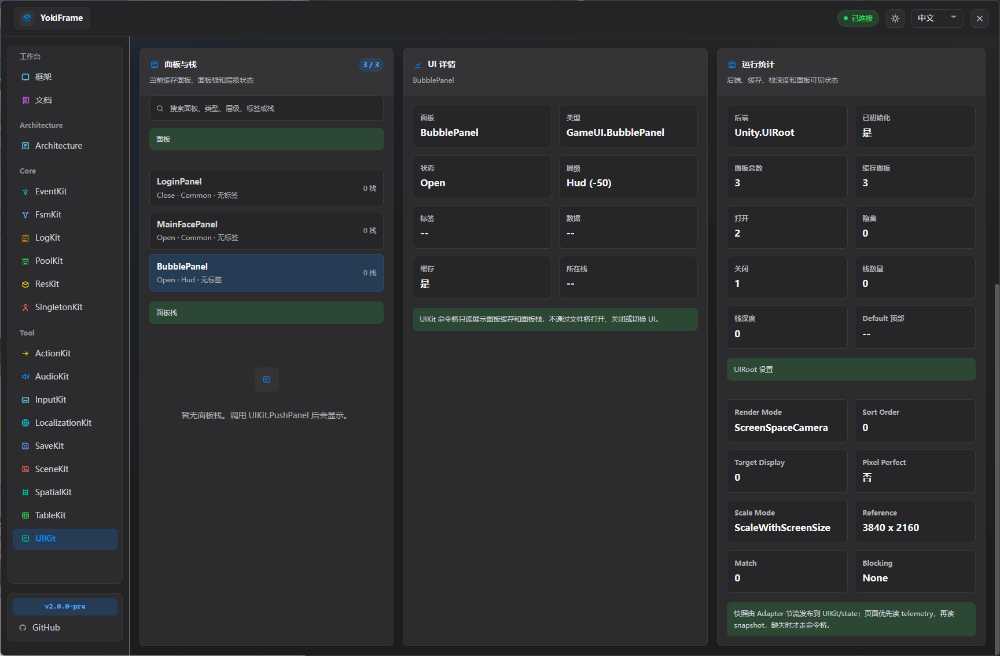
</p>

Frontend development source:

```text
YokiFrameTools/TauriEditor/dist
YokiFrameTools/TauriEditor/src-tauri
```

Packaged runtime copy:

```text
Assets/YokiFrame/TauriRuntime~/dist
```

---

## Installation

### Installer

The recommended path is the lightweight installer shipped with the package:

```text
Assets/YokiFrame/Installer~/win-x64/YokiFramePackageTool.exe
```

<p align="center">
  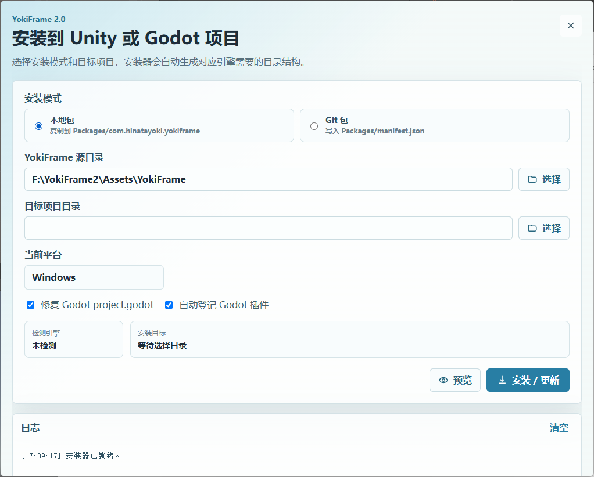
</p>

| Target Project | Mode | Notes |
| --- | --- | --- |
| Unity | Local package | Copies into `Packages/com.hinatayoki.yokiframe`, useful for offline use or local source editing. |
| Unity | Git package | Writes to `Packages/manifest.json`, allowing future updates through Unity Package Manager. |
| Godot | Local package | Installs into `addons/yokiframe/package/YokiFrame` in a Godot `.NET / C#` project and creates the Godot plugin entry. |

### Unity Package Manager

Unity projects can also install YokiFrame directly through a Git URL:

```text
https://github.com/HinataYoki/YokiFrame.git
```

Steps:

1. Open `Window > Package Manager`.
2. Click `+`, then choose `Add package from git URL`.
3. Enter the Git URL above.

The current package root is the repository root, so the default URL does not need `?path=`. To pin a branch, tag, or commit, append `#branch-or-tag`.

### Godot

The Godot installer creates:

```text
addons/yokiframe/plugin.cfg
addons/yokiframe/plugin.gd
addons/yokiframe/package/YokiFrame/
```

After the plugin is enabled, Godot registers bootstrap, autoload, the `.yokiframe` working directory, and the engine registry. Runtime commands enter through `.yokiframe/engines/godot-runtime/commands/*.json`, and responses are read from that engine's `results` directory.

---

## Quick Integration

### Unity

```csharp
using YokiFrame;

public sealed class GameEntry
{
    public void Start()
    {
        YokiFrameKit.Initialize(YokiFrameEngine.Unity);
    }

    public void Update(float deltaSeconds)
    {
        YokiFrameKit.Tick(deltaSeconds);
    }

    public void Stop()
    {
        YokiFrameKit.Shutdown();
    }
}
```

If the project should be driven by Unity lifecycle callbacks, use `UnityBootstrap` in the scene:

```csharp
using UnityEngine;
using YokiFrame.Unity;

public sealed class GameStartup : MonoBehaviour
{
    private void Awake()
    {
        _ = UnityBootstrap.Instance;
    }
}
```

### Godot

The plugin entry created by the installer handles bootstrap automatically. For manual integration:

```csharp
using YokiFrame;

YokiFrameKit.Initialize(YokiFrameEngine.Godot);
```

### Replacing The Resource Backend

SceneKit delegates to ResKit's scene backend by default, and UIKit's default panel loader also loads panels through ResKit. When integrating YooAsset or a custom resource system, prefer replacing the ResKit provider first.

```csharp
using YokiFrame;
using YokiFrame.Unity;

ResKit.SetProvider(new YooAssetResourceProvider());
```

---

## Common Code

### EventKit

```csharp
using YokiFrame;

public readonly struct PlayerDiedEvent
{
    public readonly string PlayerName;

    public PlayerDiedEvent(string playerName)
    {
        PlayerName = playerName;
    }
}

EventKit.Type.Register<PlayerDiedEvent>(OnPlayerDied);
EventKit.Type.Send(new PlayerDiedEvent("Player"));
EventKit.Type.UnRegister<PlayerDiedEvent>(OnPlayerDied);
```

### FsmKit

```csharp
using YokiFrame;

var fsm = new FSM<PlayerState>("PlayerFSM");
fsm.Add(PlayerState.Idle, new IdleState(fsm, owner));
fsm.Add(PlayerState.Run, new RunState(fsm, owner));
fsm.Start(PlayerState.Idle);

fsm.Change(PlayerState.Run);
fsm.Update();
```

### ResKit

```csharp
using YokiFrame;

var handle = ResKit.LoadAsset<MyConfig>("Configs/GameConfig");
try
{
    Use(handle.Asset);
}
finally
{
    handle.Release();
}
```

### ActionKit

```csharp
using YokiFrame;

IActionController controller = ActionKit.Sequence()
    .Callback(OnStarted)
    .Delay(0.5f)
    .Callback(OnFinished)
    .Start();

controller.Pause();
controller.Resume();
controller.Cancel();
```

### SpatialKit

```csharp
using YokiFrame;

var bounds = new YokiBounds(YokiVector3.Zero, new YokiVector3(1000f, 1000f, 1000f));
var octree = SpatialKit.CreateOctree<MySpatialEntity>(bounds);

octree.Insert(entity);
octree.QueryRadius(entity.Position, sensorRange, results);
```

---

## AI Entry Points

The package includes Skill documents for AI agents:

```text
Assets/YokiFrame/Core/Editor/Skills/
├── yokiframe/
├── yokiframe-command-bridge/
└── yokiframe-editor/
```

Recommended AI query order:

1. Read `.yokiframe/engines/<engineId>/engine.json` to confirm the current online host and capabilities.
2. Prefer `snapshots/<Kit>/<name>.json` for current state queries.
3. For details, history, read-only diagnostics, or explicit maintenance operations, write a command and wait for its result.
4. On timeout, inspect `processing`, `deadletter`, heartbeat, and `System/bridge_status`.

Do not turn high-frequency UI refresh into `send_command` polling. The command bridge is a reliable control plane, not a runtime frame-sync bus.

---

## Technical Constraints

- Current package version: `2.0.0-preview`.
- The Unity package declares compatibility with Unity `2022.3+`.
- Godot integration targets Godot 4.x `.NET / C#` projects, with Godot 4.7 as the current primary target.
- C# code remains compatible with C# 9.0.
- Core Runtime does not directly depend on Unity, Godot, Tauri, YooAsset, DOTween, FMOD, Luban, or other concrete host / tool implementations.
- The file bridge uses FileBridge v2 engine-scoped paths. New commands and responses do not use historical root command/result directories.
- High-frequency state is not written to `.yokiframe` on every update. Snapshots, telemetry, sampled events, and explicit traces carry diagnostic refresh.
- Mutating commands must pass through user intent, payload validation, CommandPolicy, and a recoverable path.

---

## Documentation Entry Points

| Goal | Location |
| --- | --- |
| Quick start and Kit docs | `Assets/YokiFrame/TauriRuntime~/dist/docs` or the Tauri workbench `Docs` page |
| Tauri workbench source | `YokiFrameTools/TauriEditor` |
| Installer source | `YokiFrameTools/Installer` |
| AI command bridge Skill | `Assets/YokiFrame/Core/Editor/Skills/yokiframe-command-bridge/SKILL.md` |
| YokiFrame usage Skill | `Assets/YokiFrame/Core/Editor/Skills/yokiframe/SKILL.md` |
| Editor workbench Skill | `Assets/YokiFrame/Core/Editor/Skills/yokiframe-editor/SKILL.md` |

---

## License

MIT License
