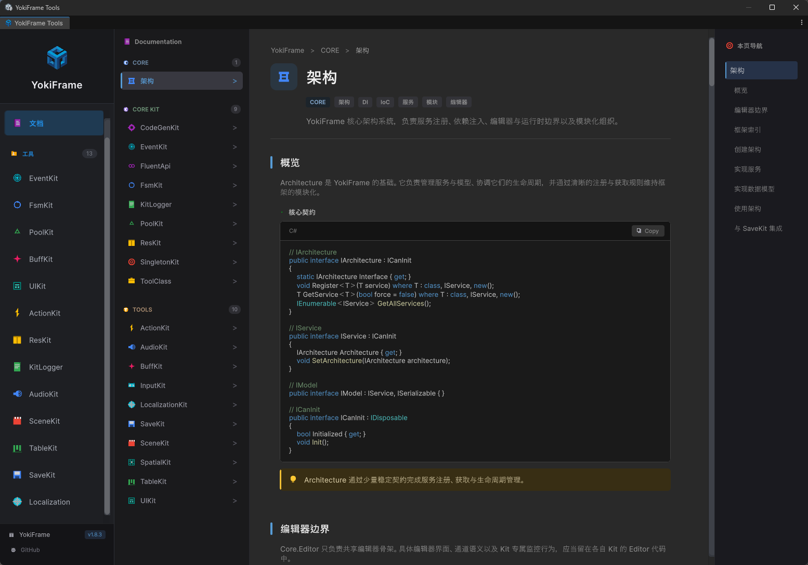
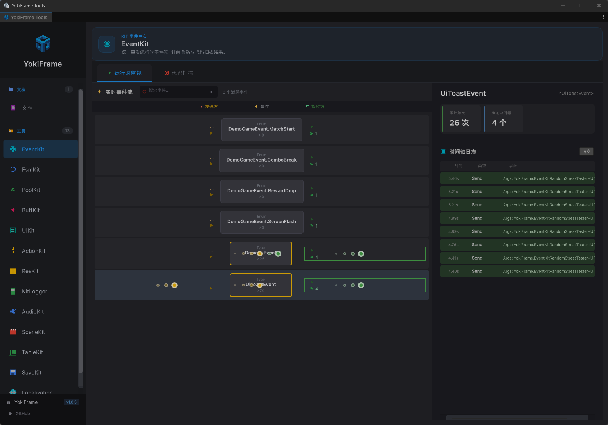
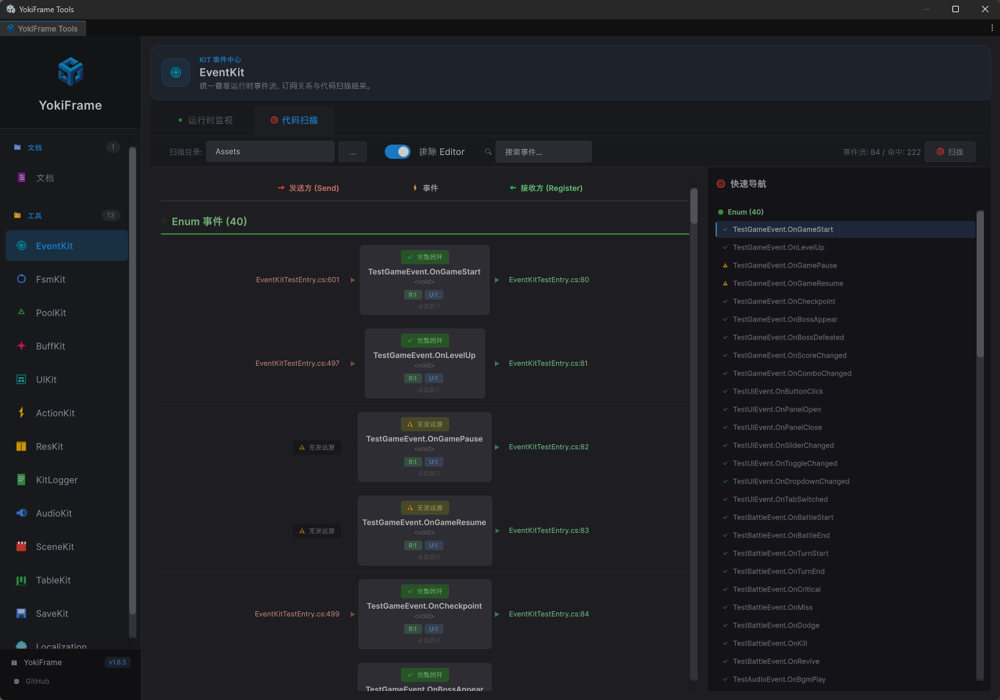
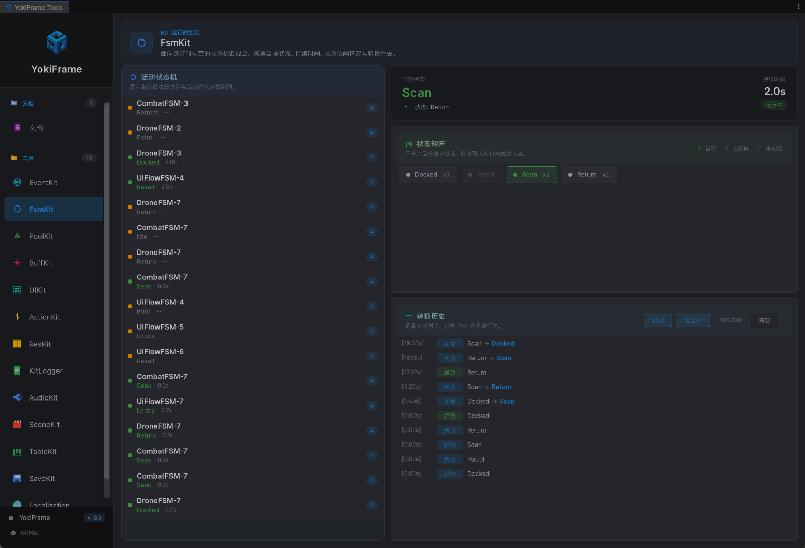
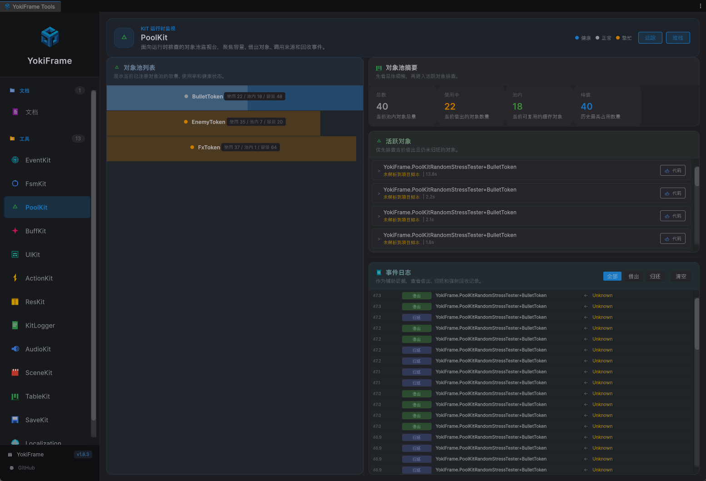

# YokiFrame

<p align="center">
  
</p>

<p align="center">
  <b>一个轻量级 Unity 开发框架</b><br>
  提供架构设计、事件系统、动作序列、状态机、UI 管理、音频管理、存档系统等常用功能模块。
</p>

---

## 目录

- [安装](#安装)
- [快速开始](#快速开始)
- [功能导航](#功能导航)
- [核心模块](#核心模块)
- [工具模块](#工具模块)
- [编辑器工具](#编辑器工具)
- [编辑器截图预览](#编辑器截图预览)
- [文档索引](#文档索引)
- [License](#license)

---

## 安装

通过 Unity Package Manager 安装：

1. 打开 `Window > Package Manager`
2. 点击 `+` > `Add package from git URL`
3. 输入：`https://github.com/HinataYoki/YokiFrame.git`

---

## 快速开始

### 最小示例

```csharp
using YokiFrame;

// 事件系统
EventKit.Type.Register<PlayerDiedEvent>(e => Debug.Log($"{e.PlayerName} 死亡"))
    .UnRegisterWhenGameObjectDestroyed(gameObject);
EventKit.Type.Send(new PlayerDiedEvent { PlayerName = "Player1" });

// 动作序列
ActionKit.Sequence()
    .Delay(1f, () => Debug.Log("1秒后"))
    .Callback(() => Debug.Log("立即执行"))
    .Start(this);

// UI 管理
UIKit.OpenPanel<MainMenuPanel>();
UIKit.ClosePanel<MainMenuPanel>();

// 音频播放
AudioKit.Play("Audio/BGM/MainTheme", AudioChannel.Bgm);
AudioKit.Play("Audio/SFX/Click");
```

### 进阶使用

按 `Ctrl+E` 打开 YokiFrame 编辑器工具面板，查看文档、监控页面和代码辅助工具。

---

## 功能导航

| 需求关键词 | 推荐模块 | 核心能力 | 代码位置 |
| --- | --- | --- | --- |
| 事件、消息、模块解耦 | EventKit | 类型安全事件系统 | `Core/Runtime/EventKit` |
| 对象池、复用、GC 优化 | PoolKit | GameObject / C# 对象池 | `Core/Runtime/PoolKit` |
| 状态机、AI、行为控制 | FsmKit | 有限状态机 | `Core/Runtime/FsmKit` |
| 单例、全局管理 | SingletonKit | 单例模式基础设施 | `Core/Runtime/SingletonKit` |
| 资源加载、AssetBundle | ResKit | 统一资源加载接口 | `Core/Runtime/ResKit` |
| UI、面板、窗口 | UIKit | 面板管理与编辑器辅助 | `Tools/UIKit` |
| 音频、BGM、音效 | AudioKit | 音频播放与通道管理 | `Tools/AudioKit` |
| 动画、延时、时序控制 | ActionKit | 链式动作序列 | `Tools/ActionKit` |
| 配置表、Excel、数据表 | TableKit | Luban 配置表工作流 | `Tools/TableKit` |
| 存档、持久化 | SaveKit | 多槽位存档系统 | `Tools/SaveKit` |
| 场景切换、异步加载 | SceneKit | 场景加载与切换 | `Tools/SceneKit` |
| 本地化、多语言 | LocalizationKit | 文本本地化 | `Tools/LocalizationKit` |
| Buff、属性修饰 | BuffKit | Buff / Debuff 系统 | `Tools/BuffKit` |
| 空间查询、邻近搜索 | SpatialKit | 空间分区与查询 | `Tools/SpatialKit` |

---

## 核心模块

核心模块之间可以相互依赖；工具模块应优先依赖核心模块，而不是彼此耦合。

| 模块 | 说明 |
| --- | --- |
| Architecture | 轻量级架构基础设施，适合依赖注入与模块化组织 |
| EventKit | 类型、枚举、字符串三类事件总线 |
| SingletonKit | MonoBehaviour / C# 单例支持 |
| PoolKit | GameObject 与纯 C# 对象池 |
| ResKit | 统一资源加载接口与后端扩展 |
| FsmKit | 状态切换、生命周期回调 |
| LogKit | 日志系统与调试辅助 |
| FluentApi | 常用链式扩展方法 |
| ToolClass | 通用工具类集合 |
| CodeGenKit | 编辑器代码生成辅助 |

---

## 工具模块

| 模块 | 说明 |
| --- | --- |
| ActionKit | 链式动作序列、延时、并行与回调组合 |
| UIKit | 现代化 UI 面板系统、面板管理与代码辅助 |
| AudioKit | 音频播放、通道音量、BGM / 音效管理 |
| SaveKit | 多槽位存档、模块化存储、序列化支持 |
| TableKit | Luban 配置表生成与查询工作流 |
| BuffKit | Buff / Debuff、容器与堆叠规则 |
| LocalizationKit | 多语言与格式化文本 |
| SceneKit | 场景异步加载、切换、预加载 |
| InputKit | 统一输入访问接口 |
| SpatialKit | 空间查询、范围搜索、近邻搜索 |

---

## 常用代码示例

### EventKit

```csharp
public struct PlayerDiedEvent
{
    public string PlayerName;
}

EventKit.Type.Register<PlayerDiedEvent>(e => Debug.Log($"{e.PlayerName} 死亡"))
    .UnRegisterWhenGameObjectDestroyed(gameObject);

EventKit.Type.Send(new PlayerDiedEvent
{
    PlayerName = "Player1"
});
```

### PoolKit

```csharp
var bullet = PoolKit.Spawn("Prefabs/Bullet", parent);
PoolKit.Recycle(bullet);
```

### FsmKit

```csharp
var fsm = new SimpleStateMachine();
fsm.ChangeState<IdleState>();
fsm.Update();
```

### UIKit

```csharp
UIKit.OpenPanel<MainMenuPanel>();
UIKit.ClosePanel<MainMenuPanel>();
```

### AudioKit

```csharp
AudioKit.Play("Audio/BGM/MainTheme", AudioChannel.Bgm);
AudioKit.SetVolume(AudioChannel.Bgm, 0.8f);
```

### SaveKit

```csharp
var saveData = SaveKit.CreateSaveData();
saveData.SetModule(new PlayerData { Level = 10 });
SaveKit.Save(0, saveData);
```

### SceneKit

```csharp
await SceneKit.LoadSceneAsync("GameScene", SceneLoadMode.Single);
```

---

## 编辑器工具

### 快捷键

| 快捷键 | 功能 |
| --- | --- |
| `Ctrl+E` | 打开 YokiFrame 工具面板 |
| `Alt+B` | 添加 UI 组件绑定 |

### 工具页概览

| 页面 | 功能 |
| --- | --- |
| 文档 | 查看 API 文档和使用示例 |
| EventKit | 事件注册与发送监控 |
| PoolKit | 对象池状态与统计查看 |
| FsmKit | 状态机运行时监控 |
| ActionKit | 动作序列执行观察 |
| UIKit | UI 面板创建与代码辅助 |
| AudioKit | 音频监控与代码辅助 |
| TableKit | 配置表生成与管理 |
| BuffKit | Buff 容器与状态查看 |
| LocalizationKit | 本地化预览与缺失检查 |
| SceneKit | 场景状态查看与管理 |

---

## 编辑器截图预览

### 文档页



### EventKit 监控页



### EventKit 扫描页



### FsmKit 监控页



### PoolKit 监控页



---

## 文档索引

- 当前入口：`Assets/YokiFrame/README.md`
- 核心代码：`Assets/YokiFrame/Core/Runtime`
- 工具模块：`Assets/YokiFrame/Tools`
- 编辑器相关：`Assets/YokiFrame/Core/Editor`

### 目录结构

```text
Assets/YokiFrame/
|- README.md
|- Core/
|  |- Runtime/
|  |- Editor/
|- Tools/
   |- ActionKit/
   |- AudioKit/
   |- UIKit/
   |- ...
```

---

## License

MIT License
