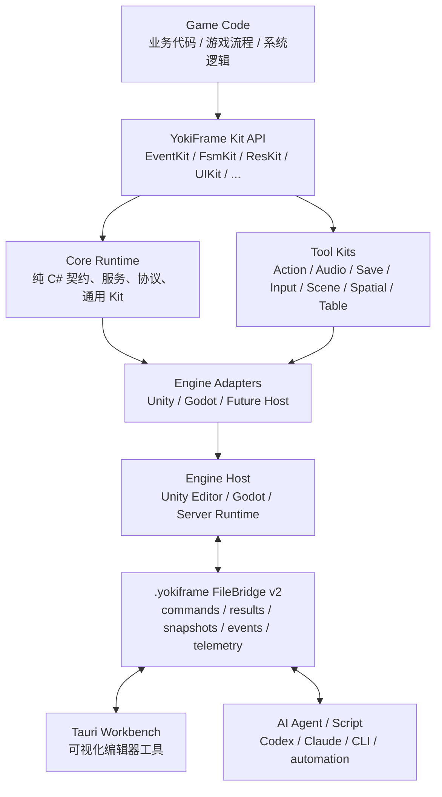
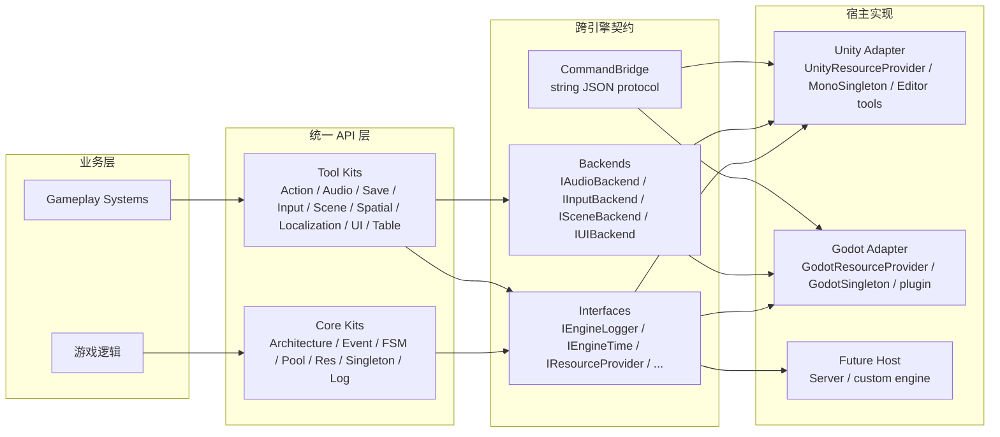
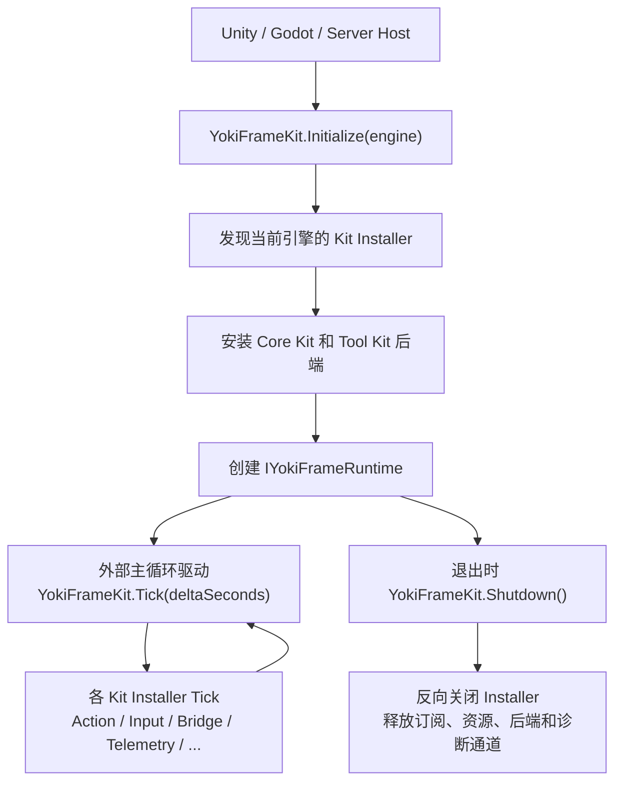
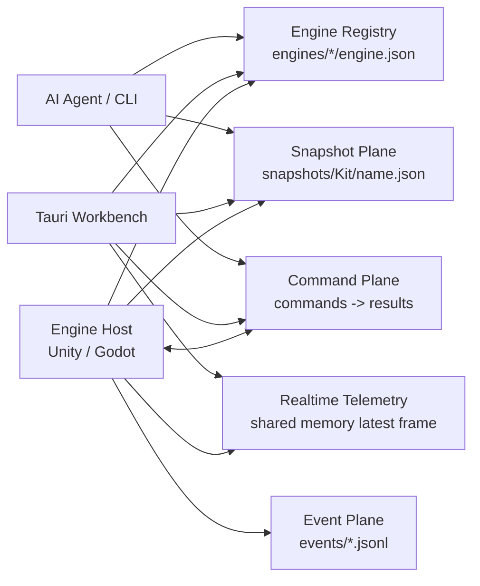
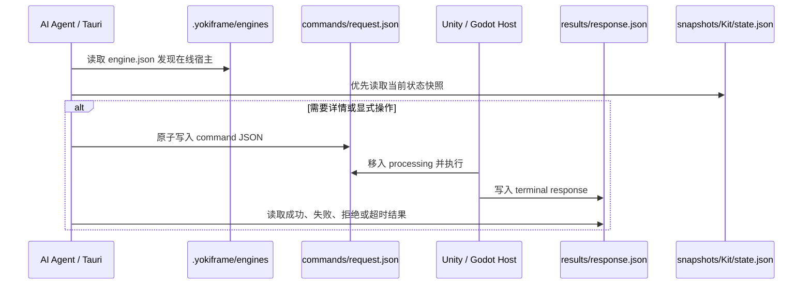
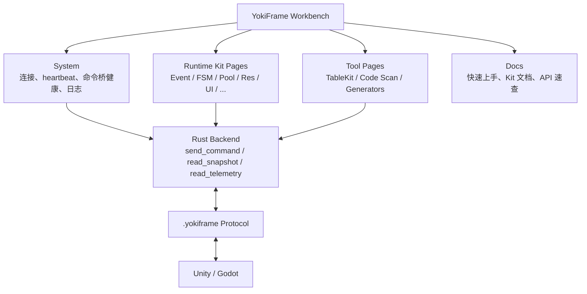

# YokiFrame

<p align="center">
  <a href="README.md">中文</a> | <a href="README.en.md">English</a>
</p>

<p align="center">
  
</p>

<p align="center">
  <b>不绑定具体游戏引擎的 C# 游戏 Kit 框架</b><br>
  通过统一 Runtime API、跨引擎 Adapter、AI 文件协议和 Tauri 编辑器工作台，把游戏运行时、工具链和 AI Agent 接到同一套协作平面上。
</p>

---

## 一句话介绍

YokiFrame 2.0 是一套跨引擎游戏开发框架。业务代码面向 `YokiFrame` 的统一 Kit API 编写，Unity、Godot 或未来其它宿主只负责通过 Adapter 提供日志、时间、资源、输入、场景、UI、音频等能力。

它同时内置 `.yokiframe/` 文件协议，让 AI Agent、Tauri 工作台、脚本和游戏宿主之间可以可靠交换命令、响应、快照、事件和实时遥测。AI 不需要直接猜 Unity 对象或依赖某个编辑器插件，就能发现在线引擎、读取框架状态、发起只读诊断或触发明确授权的维护命令。

YokiFrame 还提供了完整的 Tauri 可视化编辑器工具，用于查看 Kit 状态、命令桥健康、运行时快照、代码扫描、配置生成器、日志和内置文档。

---

## 核心定位

| 问题 | YokiFrame 的回答 |
| --- | --- |
| 游戏逻辑是否必须绑定 Unity 或 Godot？ | 不必。业务层使用统一 Kit API，宿主差异下沉到 Adapter、Provider 和 Backend。 |
| AI 如何理解运行时状态？ | 通过 `.yokiframe/engines/<engineId>` 发现宿主，读取 snapshot / telemetry，必要时发送 command。 |
| 编辑器工具是否只是一个启动器？ | 不是。Tauri 工作台是独立调试控制台，覆盖 Kit 状态、文件桥、代码扫描、生成器和文档。 |
| 框架是否会强迫使用某个资源或 UI 方案？ | 不会。ResKit、SceneKit、UIKit、AudioKit 等都通过 Provider / Backend 替换宿主实现。 |

---

## 总体结构

YokiFrame 的核心思想是：业务代码只认识框架能力，不认识具体引擎。



### 运行时分层



### 目录结构

```text
Assets/YokiFrame/
├── Core/
│   ├── Runtime/
│   │   ├── Architecture, EventKit, FsmKit, PoolKit, ResKit
│   │   ├── Singleton, LogKit, ToolClass, FluentApi, Settings
│   │   ├── Interfaces/
│   │   ├── CommandBridge/
│   │   └── Adapters/
│   │       ├── Unity/
│   │       └── Godot/
│   ├── Editor/
│   │   ├── CodeGenKit/
│   │   ├── Resources/
│   │   └── Skills/
│   └── Tests/
├── Tools/
│   ├── ActionKit, AudioKit, InputKit, LocalizationKit
│   ├── SaveKit, SceneKit, SpatialKit, TableKit, UIKit
│   └── */Runtime, */Editor, */Tests
├── TauriRuntime~/        # 包内工作台运行副本
├── Installer~/           # 包内安装器
└── Documentation~/       # README 使用的图片和补充材料

YokiFrameTools/
├── TauriEditor/          # Tauri 工作台源码
├── Installer/            # 安装器源码
└── scripts/

.yokiframe/               # 运行期文件协议目录
```

---

## Kit 能力地图

YokiFrame 把常见游戏框架能力整理成 Kit。业务侧优先调用统一入口，宿主细节由安装器和 Adapter 接入。

```mermaid
flowchart TB
    Root["YokiFrame Kits"]
    Core["Core Runtime Kits"]
    Tools["Tool Kits"]
    AI["AI Native Runtime"]
    Editor["Editor Tooling"]

    Root --> Core
    Root --> Tools
    Root --> AI
    Root --> Editor

    Core --> Architecture["Architecture"]
    Core --> EventKit["EventKit"]
    Core --> FsmKit["FsmKit"]
    Core --> PoolKit["PoolKit"]
    Core --> ResKit["ResKit"]
    Core --> SingletonKit["SingletonKit"]
    Core --> LogKit["LogKit"]

    Tools --> ActionKit["ActionKit"]
    Tools --> AudioKit["AudioKit"]
    Tools --> SaveKit["SaveKit"]
    Tools --> InputKit["InputKit"]
    Tools --> SceneKit["SceneKit"]
    Tools --> SpatialKit["SpatialKit"]
    Tools --> LocalizationKit["LocalizationKit"]
    Tools --> UIKit["UIKit"]
    Tools --> TableKit["TableKit"]

    AI --> CommandBridge["CommandBridge"]
    AI --> Snapshot["Snapshot"]
    AI --> Telemetry["Telemetry"]
    AI --> EventStream["Event Stream"]
    AI --> Skills["Agent Skills"]

    Editor --> Workbench["Tauri Workbench"]
    Editor --> CodeScan["Code Scan"]
    Editor --> Generators["Generators"]
    Editor --> Diagnostics["Diagnostics"]
```



| Kit | 主要用途 |
| --- | --- |
| Architecture | 服务注册、模块组织、架构实例和运行时诊断。 |
| EventKit | 类型事件、枚举事件和兼容事件通道，用于模块解耦。 |
| FsmKit | 普通 FSM、参数化 FSM、状态流和转换历史诊断。 |
| PoolKit | 对象池、可回收对象池、集合池和池状态快照。 |
| ResKit | 资源加载、raw 文件、场景资源后端、引用计数和 Provider 替换。 |
| SingletonKit | 纯 C# 单例、Unity `MonoSingleton<T>`、Godot `GodotSingleton<T>`。 |
| LogKit | 引擎日志适配、文件日志和工作台日志诊断。 |
| ActionKit | Delay、Callback、Sequence、Parallel、Task / Coroutine 组合和动作调试。 |
| AudioKit | 音效、音乐、音量总线、active voice 诊断和音频 ID 辅助。 |
| SaveKit | 多槽位存档、序列化/加密/迁移后端和自动保存状态。 |
| InputKit | 输入后端、动作状态、输入缓冲和输入上下文栈。 |
| SceneKit | 跨引擎场景加载、预加载、激活和卸载。 |
| SpatialKit | HashGrid、Quadtree、Octree 空间索引和查询诊断。 |
| LocalizationKit | 多语言 Provider、formatter、缓存、binder 和语言切换。 |
| UIKit | UI 后端、面板栈、层级、面板创建和绑定辅助。 |
| TableKit | 基于 Tauri 的 Luban 配置表生成、参数管理和输出校验。 |

---

## 生命周期

宿主启动时只需要声明当前引擎。`YokiFrameKit` 会发现并安装当前引擎可用的 Kit installer，之后由宿主每帧驱动 Tick，退出时统一 Shutdown。



Unity 可以直接调用统一入口：

```csharp
using YokiFrame;

YokiFrameKit.Initialize(YokiFrameEngine.Unity);
```

也可以在场景中使用 `UnityBootstrap`，它会负责初始化、`Update` 中 Tick、`OnDestroy` 中 Shutdown。

Godot 插件启用后会创建 bootstrap / autoload，运行时由 `GodotBootstrap` 在 `_Ready`、`_Process`、`_ExitTree` 中完成同样的生命周期。

---

## AI 文件协议

YokiFrame 把 AI 通信设计成框架级能力，而不是某个 IDE 插件的私有通道。当前协议入口是 engine-scoped 目录：

```text
.yokiframe/
└── engines/
    └── <engineId>/
        ├── engine.json
        ├── status/heartbeat.json
        ├── commands/<requestId>.json
        ├── commands/processing/<requestId>.json
        ├── commands/archive/
        ├── commands/deadletter/
        ├── results/<requestId>-response.json
        └── snapshots/<Kit>/<name>.json

.yokiframe/
└── events/<type>.jsonl
```

### 通信平面



| 通道 | 使用场景 | 读写特点 |
| --- | --- | --- |
| Engine Registry | 发现在线 Unity / Godot / runtime host。 | 先读 `engine.json`，再选择目标 engineId。 |
| Command Plane | 请求-响应、详情查询、显式操作、维护命令。 | 写 `commands/<requestId>.json`，读 `results/<requestId>-response.json`。 |
| Snapshot Plane | 当前状态、面板初始数据、AI 默认只读查询。 | 覆盖式 JSON 快照，适合稳定读取。 |
| Event Plane | 重要离散事件、生命周期、采样后的状态变化。 | 根级 JSONL 事件流。 |
| Realtime Telemetry | Tauri 页面的人类感知实时刷新。 | 共享内存最新帧，不用于 AI 默认查询。 |
| Trace Plane | 用户显式开启的短期高频诊断。 | ring buffer，受时长、数量和大小限制。 |

### 命令流



一个命令请求大致长这样：

```json
{
  "protocolVersion": 2,
  "requestId": "codex-ping-001",
  "engineId": "unity-editor",
  "source": "codex",
  "kit": "System",
  "action": "ping",
  "payload": {},
  "createdAtUtc": "2026-06-24T00:00:00Z",
  "timeoutMs": 10000
}
```

协议约定：

1. 新命令、新响应和新状态读取使用 `.yokiframe/engines/<engineId>`，不把历史 root 目录当作当前入口。
2. `requestId`、`engineId`、`source`、`kit`、`action` 使用安全 ASCII 标识符。
3. 写命令和响应时使用临时文件加原子重命名，避免轮询方读到半写文件。
4. 已接受命令必须产出 terminal response；未知 Kit/action、解析失败、策略拒绝、超时和异常都要有结果或 deadletter 证据。
5. 高频状态不要通过 `send_command` 轮询；Tauri 优先 telemetry，AI 优先 snapshot。

---

## Tauri 编辑器工作台

YokiFrame Editor 是 Tauri + Web 技术栈构建的桌面工作台。它面向调试和开发循环，不是营销页面。



在 Unity / Godot 编辑器中通常可通过 `Ctrl+E` 打开工作台。工作台可用于：

- 查看引擎连接、heartbeat、engine registry、FileBridge 健康和命令目录。
- 查看 Architecture、EventKit、FsmKit、PoolKit、ResKit、LogKit、ActionKit、AudioKit、SaveKit、LocalizationKit、SceneKit、SpatialKit、InputKit、UIKit、TableKit、SingletonKit 状态。
- 扫描代码关系，例如 EventKit 发送/监听/注销位置。
- 打开源码位置，由宿主默认代码编辑器处理。
- 查看运行日志、错误、快照、telemetry freshness 和 stale 状态。
- 管理 TableKit / Luban 配置生成参数和输出校验。
- 安装或同步面向 Codex、Claude Code、Cursor、Windsurf、GitHub Copilot 等 Agent 的 YokiFrame Skill。

### 工作台预览

<p align="center">
  
</p>

<p align="center">
  
</p>

<p align="center">
  
</p>

前端开发源码位于：

```text
YokiFrameTools/TauriEditor/dist
YokiFrameTools/TauriEditor/src-tauri
```

包内运行副本位于：

```text
Assets/YokiFrame/TauriRuntime~/dist
```

---

## 安装

### 安装器

推荐使用随包发布的轻量安装器安装到 Unity 或 Godot 项目：

```text
Assets/YokiFrame/Installer~/win-x64/YokiFramePackageTool.exe
```

<p align="center">
  
</p>

| 目标项目 | 安装方式 | 说明 |
| --- | --- | --- |
| Unity | 本地包 | 复制到目标项目 `Packages/com.hinatayoki.yokiframe`，适合离线使用或本地改源码。 |
| Unity | Git 包 | 写入目标项目 `Packages/manifest.json`，后续可通过 Unity Package Manager 更新。 |
| Godot | 本地包 | 安装到 Godot `.NET / C#` 项目的 `addons/yokiframe/package/YokiFrame`，并创建插件入口。 |

### Unity Package Manager

Unity 项目也可以直接通过 Git URL 安装：

```text
https://github.com/HinataYoki/YokiFrame.git
```

操作路径：

1. 打开 `Window > Package Manager`。
2. 点击 `+`，选择 `Add package from git URL`。
3. 输入上面的 Git URL。

当前 package 根目录位于仓库根目录，因此默认 URL 不带 `?path=`。需要锁定分支、tag 或 commit 时，可在末尾追加 `#branch-or-tag`。

### Godot

Godot 安装器会创建：

```text
addons/yokiframe/plugin.cfg
addons/yokiframe/plugin.gd
addons/yokiframe/package/YokiFrame/
```

启用插件后，Godot 会注册 bootstrap、autoload、`.yokiframe` 工作目录和 engine registry。运行时命令通过 `.yokiframe/engines/godot-runtime/commands/*.json` 进入，响应从同 engine 的 `results` 目录读取。

---

## 快速接入

### Unity

```csharp
using YokiFrame;

public sealed class GameEntry
{
    public void Start()
    {
        YokiFrameKit.Initialize(YokiFrameEngine.Unity);
    }

    public void Update(float deltaSeconds)
    {
        YokiFrameKit.Tick(deltaSeconds);
    }

    public void Stop()
    {
        YokiFrameKit.Shutdown();
    }
}
```

如果项目希望由 Unity 生命周期自动驱动，可以在场景中使用 `UnityBootstrap`：

```csharp
using UnityEngine;
using YokiFrame.Unity;

public sealed class GameStartup : MonoBehaviour
{
    private void Awake()
    {
        _ = UnityBootstrap.Instance;
    }
}
```

### Godot

安装器创建的插件入口会自动处理 bootstrap。手动接入时可以调用：

```csharp
using YokiFrame;

YokiFrameKit.Initialize(YokiFrameEngine.Godot);
```

### 替换资源后端

SceneKit 默认委托 ResKit 的场景后端，UIKit 默认面板加载器也通过 ResKit 加载面板。因此接入 YooAsset 或自定义资源系统时，优先替换 ResKit Provider。

```csharp
using YokiFrame;
using YokiFrame.Unity;

ResKit.SetProvider(new YooAssetResourceProvider());
```

---

## 常用代码

### EventKit

```csharp
using YokiFrame;

public readonly struct PlayerDiedEvent
{
    public readonly string PlayerName;

    public PlayerDiedEvent(string playerName)
    {
        PlayerName = playerName;
    }
}

EventKit.Type.Register<PlayerDiedEvent>(OnPlayerDied);
EventKit.Type.Send(new PlayerDiedEvent("Player"));
EventKit.Type.UnRegister<PlayerDiedEvent>(OnPlayerDied);
```

### FsmKit

```csharp
using YokiFrame;

var fsm = new FSM<PlayerState>("PlayerFSM");
fsm.Add(PlayerState.Idle, new IdleState(fsm, owner));
fsm.Add(PlayerState.Run, new RunState(fsm, owner));
fsm.Start(PlayerState.Idle);

fsm.Change(PlayerState.Run);
fsm.Update();
```

### ResKit

```csharp
using YokiFrame;

var handle = ResKit.LoadAsset<MyConfig>("Configs/GameConfig");
try
{
    Use(handle.Asset);
}
finally
{
    handle.Release();
}
```

### ActionKit

```csharp
using YokiFrame;

IActionController controller = ActionKit.Sequence()
    .Callback(OnStarted)
    .Delay(0.5f)
    .Callback(OnFinished)
    .Start();

controller.Pause();
controller.Resume();
controller.Cancel();
```

### SpatialKit

```csharp
using YokiFrame;

var bounds = new YokiBounds(YokiVector3.Zero, new YokiVector3(1000f, 1000f, 1000f));
var octree = SpatialKit.CreateOctree<MySpatialEntity>(bounds);

octree.Insert(entity);
octree.QueryRadius(entity.Position, sensorRange, results);
```

---

## AI 使用入口

包内包含面向 Agent 的 Skill 文档：

```text
Assets/YokiFrame/Core/Editor/Skills/
├── yokiframe/
├── yokiframe-command-bridge/
└── yokiframe-editor/
```

推荐 AI 查询顺序：

1. 读取 `.yokiframe/engines/<engineId>/engine.json`，确认当前在线宿主和能力。
2. 查询当前状态时优先读取 `snapshots/<Kit>/<name>.json`。
3. 需要详情、历史、只读诊断或明确维护操作时，再写入 command 并等待 result。
4. 请求超时时查看 `processing`、`deadletter`、heartbeat 和 `System/bridge_status`。

不要把高频 UI 刷新做成 `send_command` 轮询；命令桥是可靠控制面，不是运行时帧同步总线。

---

## 技术约束

- 当前 package 版本：`2.0.0-preview`。
- Unity 包声明兼容 Unity `2022.3+`。
- Godot 接入面向 Godot 4.x `.NET / C#` 项目，当前主要目标为 Godot 4.7。
- C# 代码保持 C# 9.0 兼容。
- Core Runtime 不直接依赖 Unity、Godot、Tauri、YooAsset、DOTween、FMOD 或 Luban 等具体宿主或工具实现。
- 文件桥使用 FileBridge v2 engine-scoped 路径；新命令和响应不走历史 root command/result 目录。
- 高频状态不逐次写 `.yokiframe` 文件；用 snapshot、telemetry、事件采样和显式 trace 承担诊断刷新。
- 变更型命令必须经过用户意图、payload 校验、CommandPolicy 和可回退路径。

---

## 文档入口

| 目标 | 位置 |
| --- | --- |
| 快速上手和 Kit 文档 | `Assets/YokiFrame/TauriRuntime~/dist/docs` 或 Tauri 工作台 `Docs` 页面 |
| Tauri 工作台源码 | `YokiFrameTools/TauriEditor` |
| 安装器源码 | `YokiFrameTools/Installer` |
| AI 命令桥 Skill | `Assets/YokiFrame/Core/Editor/Skills/yokiframe-command-bridge/SKILL.md` |
| YokiFrame 使用 Skill | `Assets/YokiFrame/Core/Editor/Skills/yokiframe/SKILL.md` |
| 编辑器工作台 Skill | `Assets/YokiFrame/Core/Editor/Skills/yokiframe-editor/SKILL.md` |

---

## License

MIT License
